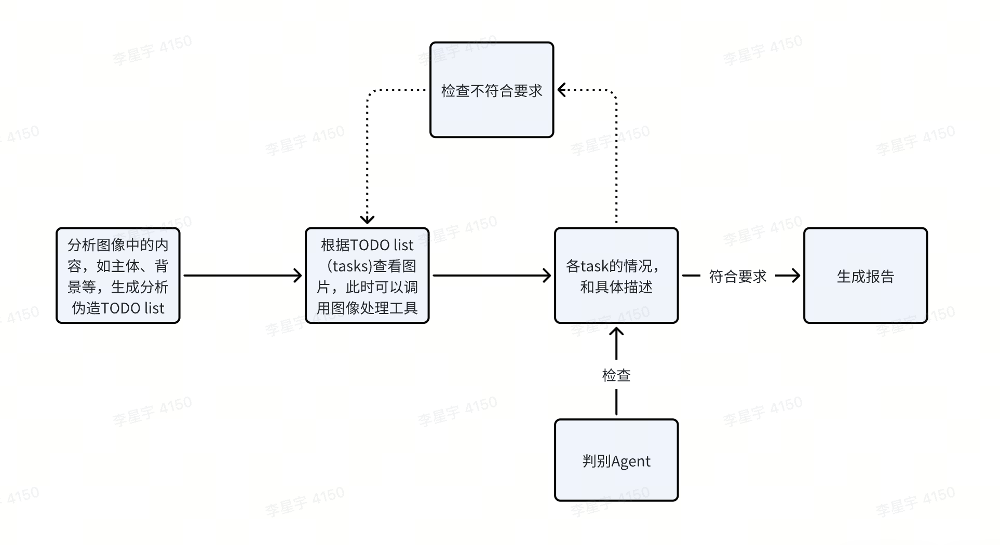

### 项目介绍
  该项目是一个基于Deepfake技术的智能代理系统，旨在帮助用户识别Deepfake图像。

### Quick Start
#### 安装uv
```bash
pip install uv
```
#### 安装依赖
```bash
uv sync
source .venv/bin/activate
```

windows:
```bash
uv sync
.venv\Scripts\activate
```

#### conf
需要增加的配置项
百炼控制台：https://help.aliyun.com/zh/model-studio/models?spm=a2c4g.11186623.0.0.f4d25e66fkEE4v#94b18818a6ywy

- openai api key
    路径： chat_model/conf/conf.yaml
    格式：
    ```yaml
    qwen-vl:
        api_key: "sk-xxxx"
        api_base: "https://api.openai.com/v1"
        model: "qwen-vl"
        max_tokens: 2048
    ```
- db config
    路径： db/conf/conf.yaml
    格式：
    ```yaml
    db:
        host: "localhost"
        port: 3306
        user: "root"
        password: "123456"
        database: "deepfake"
    ```
- 其他配置项

### RUN
python main.py

### Agent流程图
    


### 项目规范
#### log
传入上下文变量用例：
```python
ctx = {"log_id": "test"}
set_context(ctx)
logs.info("Message with dict context")
```